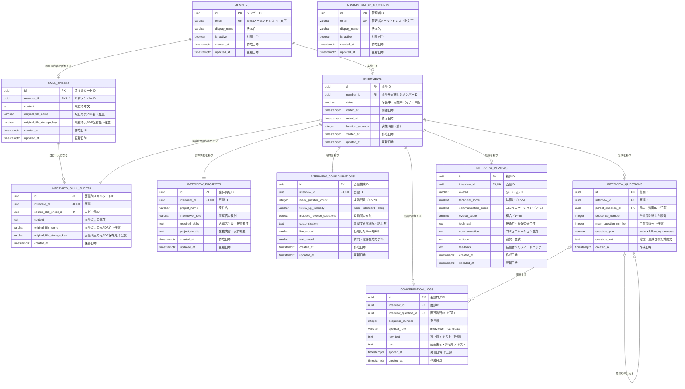

# データベースER図

面談時点の入力・生成結果を後から再現できるよう、案件情報、面談構成、質問、会話ログ、総評は面談ごとに保存する。
ログインユーザーのスキルシートは常に1件を更新し、面談開始時の入力内容を面談ごとのスナップショットとして保存する。

## 制約・運用ルール

- `members.email` は小文字へ正規化し、一意制約を設定する。同一Entraテナントのログインユーザーは初回利用時にここへ自動登録する。無効化されたメンバーはAPIを利用できない。
- `administrator_accounts` は管理者専用の独立テーブルとし、アプリケーションから自動登録・更新しない。管理者レコードは運用担当者が手動で追加する。
- `skill_sheets.member_id` に一意制約を設定し、メンバーごとに現在のスキルシートを最大1件だけ保持する。「スキルシートを更新」の操作で同じレコードを上書きする。
- 案件、構成、質問、会話ログ、総評は `interviews.member_id` と各 `interview_id` を通して所有メンバーへ紐づけ、重複する `member_id` は持たせない。
- 面談開始時の入力内容を `interview_skill_sheets` へコピーする。現在のスキルシートが未保存なら、同一トランザクション内で先に `skill_sheets` へ保存してからコピーする。保存済みシートを編集したまま開始した場合、現在のシートは上書きせず、編集内容だけをその面談のスナップショットとして保存する。
- 面談ごとのスナップショットを残すため、`interview_projects` と `interview_configurations` はマスタ化せず、`interview_id` に一意制約を設定する。
- `interview_questions` と `conversation_logs` は、それぞれ `(interview_id, sequence_number)` に一意制約を設定して発生順を保証する。深掘り質問は `parent_question_id` で元の主質問に関連付ける。
- `interview_reviews` は総評生成が完了するまでは存在しない。再生成時は同じレコードを更新する。生成履歴も必要なら、`interview_id` の一意制約を外して `revision_number` を追加する。
- メールアドレスは認証照合に使うため、暗号化よりもアクセス制御、監査ログ、最小権限を優先する。スキルシートと会話ログは個人情報として保存期間と削除方針を定める。

## 想定インデックス

- `administrator_accounts (email)` unique（手動登録用）
- `members (email)` unique
- `skill_sheets (member_id)` unique
- `interview_skill_sheets (interview_id)` unique
- `interviews (member_id, started_at desc)`
- `conversation_logs (interview_id, sequence_number)` unique
- `interview_questions (interview_id, sequence_number)` unique
- `interview_questions (interview_id, main_question_number)` partial unique（`question_type = 'main'`）
